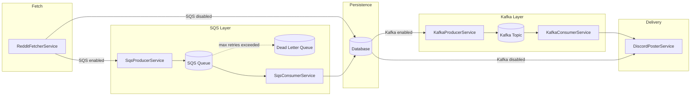

# Design Document: SQS-Kafka Integration

## Overview

This design introduces AWS SQS and Apache Kafka into the DankPoster meme pipeline to decouple ingestion from delivery. Today the pipeline is synchronous: `MemeScheduler` triggers `RedditFetcherService` which fetches, scores, deduplicates, and persists memes in a single blocking call, and a second scheduler polls the DB for unposted memes to deliver via `DiscordPosterService`.

The new architecture inserts two message boundaries:

1. **SQS** sits between fetching and persistence — the fetcher enqueues `MemeMessage` payloads, and a consumer polls the queue, deduplicates, and persists.
2. **Kafka** sits between persistence and delivery — after a meme is persisted, a delivery event is published to a topic, and a consumer triggers Discord posting.

Both integrations are independently toggleable via `@ConditionalOnProperty`, so the existing scheduler-based flow remains the default and each integration can be adopted incrementally.

### Key Design Decisions

| Decision | Rationale |
|---|---|
| Use Spring Cloud AWS SQS (`io.awspring.cloud:spring-cloud-aws-starter-sqs`) | Provides `SqsTemplate` and `@SqsListener` with auto-configuration, consistent with Spring Boot idioms. |
| Use Spring Kafka (`spring-kafka`) | Provides `KafkaTemplate` and `@KafkaListener` with auto-configuration, well-supported in Spring Boot 3.5. |
| Jackson for all serialization | Already used for Reddit DTOs. Keeps a single serializer across SQS and Kafka boundaries. |
| Java records for message DTOs | Immutable, concise, and Jackson-compatible. Fits Java 17 idioms. |
| `@ConditionalOnProperty` for bean loading | Matches the existing pattern used for meme sources. Zero-cost when disabled — beans are never instantiated. |
| Sequential SQS consumption | Required by Requirement 2.7 to preserve deduplication correctness. Single-threaded polling avoids race conditions on `existsByRedditId`. |

## Architecture



### Flow Modes (Feature Toggle Matrix)

| SQS Enabled | Kafka Enabled | Ingestion Path | Delivery Path |
|---|---|---|---|
| false | false | Fetcher → DB (existing) | Scheduler → Discord (existing) |
| true | false | Fetcher → SQS → Consumer → DB | Scheduler → Discord (existing) |
| false | true | Fetcher → DB (existing) | Persist → Kafka → Consumer → Discord |
| true | true | Fetcher → SQS → Consumer → DB | Persist → Kafka → Consumer → Discord |

## Components and Interfaces

### New Configuration Classes

#### `SqsProperties`
```java
@Data
@ConfigurationProperties(prefix = "meme.queue.sqs")
public class SqsProperties {
    private boolean enabled = false;
    private String queueUrl;        // from ${SQS_QUEUE_URL}
    private String dlqUrl;          // from ${SQS_DLQ_URL}
    private String region;          // from ${AWS_REGION:us-east-1}
    private Duration pollInterval = Duration.ofSeconds(10);
}
```

#### `KafkaProperties`
```java
@Data
@ConfigurationProperties(prefix = "meme.stream.kafka")
public class KafkaProperties {
    private boolean enabled = false;
    private String bootstrapServers; // from ${KAFKA_BOOTSTRAP_SERVERS:localhost:9092}
    private String topic;            // from ${KAFKA_TOPIC:meme-delivery}
    private String consumerGroup;    // from ${KAFKA_CONSUMER_GROUP:dankposter-delivery}
}
```

### New DTO Records

#### `MemeMessage` — SQS payload
```java
public record MemeMessage(
    String title,
    String imageUrl,
    String sourceIdentifier,   // e.g. "reddit"
    String sourceSpecificId,   // e.g. Reddit post ID
    Double danknessScore
) {}
```

#### `MemeDeliveryEvent` — Kafka payload
```java
public record MemeDeliveryEvent(
    Long memeId,
    String title,
    String imageUrl,
    Double danknessScore
) {}
```

### New Service Components

#### `SqsProducerService`
- Conditionally loaded: `@ConditionalOnProperty(name = "meme.queue.sqs.enabled", havingValue = "true")`
- Injects `SqsTemplate` and `ObjectMapper`
- Exposes `void send(MemeMessage message)` — serializes to JSON and sends to the configured queue URL
- On send failure: logs error with `sourceSpecificId` and source name, does not throw

#### `SqsConsumerService`
- Conditionally loaded: `@ConditionalOnProperty(name = "meme.queue.sqs.enabled", havingValue = "true")`
- Polls the SQS queue on a scheduled interval (`pollInterval`)
- Deserializes `MemeMessage` from JSON
- Checks `MemeRepository.existsByRedditId(sourceSpecificId)` for deduplication
- Persists new memes via `MemeRepository.save()`
- Deletes processed messages from the queue
- Failed messages are left on the queue for SQS retry → DLQ routing
- After successful persist, delegates to `KafkaProducerService` (if Kafka is enabled) to publish a delivery event

#### `KafkaProducerService`
- Conditionally loaded: `@ConditionalOnProperty(name = "meme.stream.kafka.enabled", havingValue = "true")`
- Injects `KafkaTemplate<String, String>` and `ObjectMapper`
- Exposes `void publishDeliveryEvent(MemeDeliveryEvent event)` — serializes to JSON, sends with `memeId` as key
- Retry: 3 attempts with exponential backoff (configured in Kafka producer properties)
- On failure after retries: logs error with `memeId`

#### `KafkaConsumerService`
- Conditionally loaded: `@ConditionalOnProperty(name = "meme.stream.kafka.enabled", havingValue = "true")`
- Uses `@KafkaListener(topics = ..., groupId = ...)` to consume delivery events
- Deserializes `MemeDeliveryEvent` from JSON
- Looks up `Meme` by `memeId` from `MemeRepository`
- If not found: logs warning, skips
- If already posted: skips
- Otherwise: invokes `DiscordPosterService.postNextUnpostedMeme()` (or a new targeted method) and marks as posted
- Offset commit: manual after successful Discord post

### Modified Existing Components

#### `RedditFetcherService`
- When SQS is enabled: instead of persisting directly, converts each scored meme to a `MemeMessage` and delegates to `SqsProducerService.send()`
- When SQS is disabled: existing behavior unchanged
- The service receives an `Optional<SqsProducerService>` to handle the conditional bean gracefully

#### `MemeScheduler`
- The `memePoster()` scheduler should be conditionally active only when Kafka is disabled, since Kafka consumers take over delivery
- Uses `@ConditionalOnProperty(name = "meme.stream.kafka.enabled", havingValue = "false", matchIfMissing = true)` on a scheduler config or wraps the call with a runtime check

### Auto-Configuration Classes

#### `SqsAutoConfiguration`
- `@Configuration` + `@ConditionalOnProperty(name = "meme.queue.sqs.enabled", havingValue = "true")`
- Registers `SqsClient` bean (using `SqsProperties.region`)
- Registers `SqsTemplate` bean
- Registers `SqsProducerService` and `SqsConsumerService` beans

#### `KafkaAutoConfiguration`
- `@Configuration` + `@ConditionalOnProperty(name = "meme.stream.kafka.enabled", havingValue = "true")`
- Configures `ProducerFactory` and `ConsumerFactory` using `KafkaProperties`
- Registers `KafkaTemplate` bean
- Registers `KafkaProducerService` and `KafkaConsumerService` beans
- Configures producer retries (3 attempts, exponential backoff)

## Data Models

### `MemeMessage` (SQS DTO)

| Field | Type | Description | Maps to Meme |
|---|---|---|---|
| `title` | `String` | Meme title | `Meme.title` |
| `imageUrl` | `String` | Image URL | `Meme.imageUrl` |
| `sourceIdentifier` | `String` | Source name (e.g. "reddit") | — |
| `sourceSpecificId` | `String` | Source-specific ID | `Meme.redditId` |
| `danknessScore` | `Double` | Pre-computed score | `Meme.danknessScore` |

Serialized as JSON via Jackson. Example:
```json
{
  "title": "When the code compiles on first try",
  "imageUrl": "https://i.redd.it/abc123.jpg",
  "sourceIdentifier": "reddit",
  "sourceSpecificId": "t3_xyz789",
  "danknessScore": 42.0
}
```

### `MemeDeliveryEvent` (Kafka DTO)

| Field | Type | Description | Maps to Meme |
|---|---|---|---|
| `memeId` | `Long` | Database primary key | `Meme.id` |
| `title` | `String` | Meme title | `Meme.title` |
| `imageUrl` | `String` | Image URL | `Meme.imageUrl` |
| `danknessScore` | `Double` | Dankness score | `Meme.danknessScore` |

Serialized as JSON via Jackson. The `memeId` is also used as the Kafka message key (as a String) to ensure per-meme ordering.

### Existing `Meme` Entity — No Changes

The existing `Meme` JPA entity is not modified. The new DTOs map to/from it via simple conversion methods in the service layer.

### Configuration YAML Additions

```yaml
meme:
  queue:
    sqs:
      enabled: ${SQS_ENABLED:false}
      queue-url: ${SQS_QUEUE_URL:}
      dlq-url: ${SQS_DLQ_URL:}
      region: ${AWS_REGION:us-east-1}
      poll-interval: ${SQS_POLL_INTERVAL:10s}
  stream:
    kafka:
      enabled: ${KAFKA_ENABLED:false}
      bootstrap-servers: ${KAFKA_BOOTSTRAP_SERVERS:localhost:9092}
      topic: ${KAFKA_TOPIC:meme-delivery}
      consumer-group: ${KAFKA_CONSUMER_GROUP:dankposter-delivery}
```

## Correctness Properties

*A property is a characteristic or behavior that should hold true across all valid executions of a system — essentially, a formal statement about what the system should do. Properties serve as the bridge between human-readable specifications and machine-verifiable correctness guarantees.*

### Property 1: MemeMessage serialization round-trip

*For any* valid `MemeMessage` (with non-null title, imageUrl, sourceIdentifier, sourceSpecificId, and danknessScore), serializing it to JSON via Jackson and then deserializing the JSON back into a `MemeMessage` shall produce an object equal to the original.

**Validates: Requirements 1.2, 6.1, 6.2, 6.3**

### Property 2: MemeDeliveryEvent serialization round-trip

*For any* valid `MemeDeliveryEvent` (with non-null memeId, title, imageUrl, and danknessScore), serializing it to JSON via Jackson and then deserializing the JSON back into a `MemeDeliveryEvent` shall produce an object equal to the original.

**Validates: Requirements 3.2, 6.4, 6.5, 6.6**

### Property 3: Deduplication preserves uniqueness

*For any* sequence of `MemeMessage` objects (including sequences with duplicate `sourceSpecificId` values), processing them through the SQS consumer's deduplication logic shall persist exactly one meme per unique `sourceSpecificId`, regardless of how many duplicates appear in the input sequence.

**Validates: Requirements 2.2, 2.7**

### Property 4: Kafka message key matches meme database ID

*For any* `MemeDeliveryEvent` published by the Kafka producer, the Kafka message key shall equal the string representation of the event's `memeId` field.

**Validates: Requirements 3.3**

### Property 5: Successful delivery marks meme as posted

*For any* meme that is successfully delivered to Discord via the Kafka consumer, the meme's `posted` flag in the database shall be `true` after the delivery completes.

**Validates: Requirements 4.3**

## Error Handling

### SQS Producer Errors

- **Send failure**: Log at `error` level with `sourceSpecificId` and source name. Continue processing remaining memes in the batch. The fetch cycle is never halted by a single send failure (Req 1.3).
- **Serialization failure**: Log at `error` level. Skip the individual meme. This should not occur with well-formed `MemeMessage` records but is handled defensively.

### SQS Consumer Errors

- **Deserialization failure**: Log at `error` level with the raw message body. Do not delete the message — let SQS retry. After max retries, SQS routes to the DLQ (Req 2.5).
- **Database persistence failure**: Log at `error` level. Do not delete the message — SQS will redeliver. Transient DB errors are retried automatically.
- **Duplicate detection**: Log at `debug` level (Req 2.3). Delete the message from the queue — this is expected behavior, not an error.

### Kafka Producer Errors

- **Publish failure**: Retry up to 3 times with exponential backoff (configured via Spring Kafka producer `retries` and `retry.backoff.ms` properties). After exhausting retries, log at `error` level with `memeId` (Req 3.4). The meme remains in the database with `posted = false` and can be picked up by the fallback scheduler or a future retry mechanism.

### Kafka Consumer Errors

- **Meme not found in DB**: Log at `warn` level with `memeId` (Req 4.4). Skip the message and commit the offset — the meme was likely deleted.
- **Discord posting failure**: Log at `error` level. Do not commit the Kafka offset — the message will be redelivered based on the consumer group retry policy (Req 4.5).
- **Deserialization failure**: Log at `error` level. Skip and commit — a malformed event cannot be retried successfully.

## Testing Strategy

### Property-Based Testing

Use **jqwik** (`net.jqwik:jqwik:1.9.1`) as the property-based testing library. jqwik integrates natively with JUnit 5 and provides `@Property`, `@ForAll`, and custom `Arbitrary` generators.

Each property test must:
- Run a minimum of 100 iterations (jqwik default is 1000, which exceeds this)
- Reference the design property in a tag comment
- Use custom `Arbitrary` generators for `MemeMessage` and `MemeDeliveryEvent`

#### Property Tests

1. **MemeMessage round-trip** (Property 1)
   - Tag: `Feature: sqs-kafka-integration, Property 1: MemeMessage serialization round-trip`
   - Generator: random `MemeMessage` records with arbitrary strings and doubles
   - Assert: `objectMapper.readValue(objectMapper.writeValueAsString(msg), MemeMessage.class).equals(msg)`

2. **MemeDeliveryEvent round-trip** (Property 2)
   - Tag: `Feature: sqs-kafka-integration, Property 2: MemeDeliveryEvent serialization round-trip`
   - Generator: random `MemeDeliveryEvent` records with arbitrary longs, strings, and doubles
   - Assert: `objectMapper.readValue(objectMapper.writeValueAsString(event), MemeDeliveryEvent.class).equals(event)`

3. **Deduplication preserves uniqueness** (Property 3)
   - Tag: `Feature: sqs-kafka-integration, Property 3: Deduplication preserves uniqueness`
   - Generator: random lists of `MemeMessage` with controlled duplicate `sourceSpecificId` values
   - Assert: after processing, the number of persisted memes equals the number of distinct `sourceSpecificId` values in the input

4. **Kafka message key matches meme ID** (Property 4)
   - Tag: `Feature: sqs-kafka-integration, Property 4: Kafka message key matches meme database ID`
   - Generator: random `MemeDeliveryEvent` records
   - Assert: the key passed to `KafkaTemplate.send()` equals `String.valueOf(event.memeId())`

5. **Successful delivery marks posted** (Property 5)
   - Tag: `Feature: sqs-kafka-integration, Property 5: Successful delivery marks meme as posted`
   - Generator: random `Meme` entities with `posted = false`
   - Assert: after successful delivery processing, `meme.isPosted() == true`

### Unit Tests

Unit tests complement property tests by covering specific examples, edge cases, and integration points:

- **SQS Producer**: verify send is called for each meme; verify error logging on SQS failure without halting (Req 1.3)
- **SQS Consumer**: verify duplicate meme is acknowledged but not persisted (Req 2.3); verify message deletion after successful persist (Req 2.4)
- **Kafka Producer**: verify retry behavior on publish failure (Req 3.4)
- **Kafka Consumer**: verify meme-not-found logs warning and skips (Req 4.4); verify Discord failure does not commit offset (Req 4.5)
- **Configuration binding**: verify `SqsProperties` and `KafkaProperties` bind correctly from YAML with defaults (Req 5.1–5.6)
- **Feature toggles**: verify `@ConditionalOnProperty` loads/excludes beans for all 4 toggle combinations (Req 7.1–7.5)
- **Edge case**: meme already posted when Kafka consumer receives event — should skip without re-posting

### Test Dependencies

Add to `pom.xml` test scope:
```xml
<dependency>
    <groupId>net.jqwik</groupId>
    <artifactId>jqwik</artifactId>
    <version>1.9.1</version>
    <scope>test</scope>
</dependency>
```
