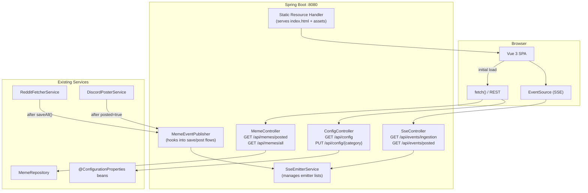
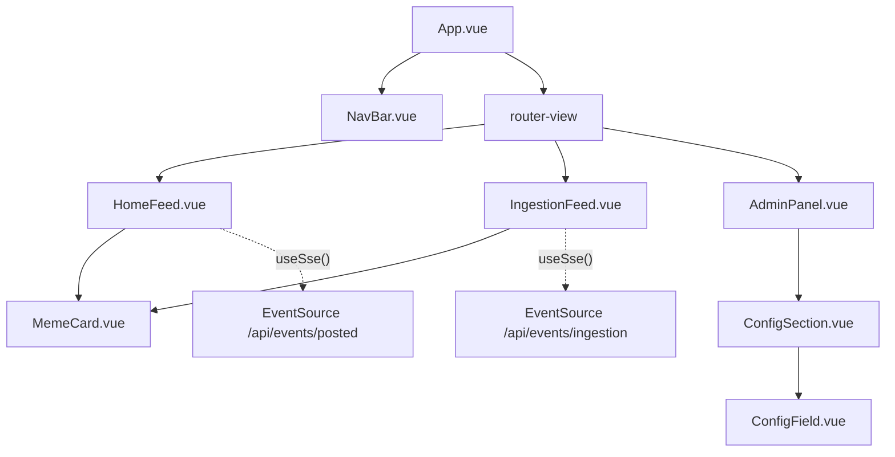

# Design Document: Vue 3 Frontend Dashboard

## Overview

This design adds a Vue 3 SPA dashboard to the existing DankPoster Spring Boot backend. The frontend lives in a `frontend/` directory at the project root, built with Vite, and outputs compiled assets to `src/main/resources/static/` so Spring Boot serves everything as a single deployable unit on port 8080.

The dashboard has three views:
- **Home Feed** — memes posted to Discord, updated in real-time via SSE
- **Ingestion Feed** — memes as they're fetched from Reddit and stored, updated in real-time via SSE
- **Admin Panel** — view and edit all runtime configuration grouped by category

The backend exposes:
- REST endpoints under `/api/memes/` for paginated initial data loads
- SSE endpoints under `/api/events/` for real-time push
- Config endpoints under `/api/config/` for reading and updating runtime settings

No authentication is required (dev tool). No state management library — Vue 3 Composition API with reactive `ref`/`reactive` is sufficient.

## Architecture



### Key Design Decisions

1. **SseEmitter over WebFlux Flux**: The project already has `spring-boot-starter-web` as the primary web stack. `SseEmitter` is the idiomatic SSE approach for servlet-based Spring MVC. No need to introduce a reactive endpoint just for SSE.

2. **MemeEventPublisher as a Spring event bridge**: Rather than modifying `RedditFetcherService` and `DiscordPosterService` directly, we introduce a `MemeEventPublisher` that listens to Spring application events. The existing services publish events after persistence/posting, and the publisher fans them out to SSE subscribers. This keeps the existing code minimally changed.

3. **Runtime config updates via reflection on @ConfigurationProperties beans**: The config beans (`SqsProperties`, `KafkaProperties`, `RedditProperties`, `DiscordConfig`) are Spring-managed singletons. The `ConfigController` injects them and calls their Lombok-generated setters directly. No reflection needed — Lombok `@Data` already generates setters.

4. **No frontend build plugin in Maven**: The Vite build is a separate `npm run build` step. The Maven build just packages whatever is in `src/main/resources/static/`. This keeps the build simple and avoids `frontend-maven-plugin` complexity.

5. **Vue Router in hash mode**: Using hash mode (`createWebHashHistory`) avoids the need for a Spring MVC catch-all route to support HTML5 history mode. The SPA works with `/#/`, `/#/ingestion`, `/#/admin`.

## Components and Interfaces

### Backend Components

#### MemeController
```java
@RestController
@RequestMapping("/api/memes")
@RequiredArgsConstructor
public class MemeController {
    Page<MemeDto> getPostedMemes(@RequestParam int page, @RequestParam int size);
    Page<MemeDto> getAllMemes(@RequestParam int page, @RequestParam int size);
}
```
- `GET /api/memes/posted?page=0&size=20` — returns posted memes, ordered by `id` desc
- `GET /api/memes/all?page=0&size=20` — returns all memes, ordered by `id` desc

#### SseController
```java
@RestController
@RequestMapping("/api/events")
@RequiredArgsConstructor
public class SseController {
    SseEmitter streamIngestionEvents();
    SseEmitter streamPostedEvents();
}
```
- `GET /api/events/ingestion` — returns `SseEmitter` for ingestion events
- `GET /api/events/posted` — returns `SseEmitter` for posted events

#### SseEmitterService
```java
@Service
public class SseEmitterService {
    SseEmitter createEmitter(String channel);
    void broadcast(String channel, Object data);
}
```
Manages a `ConcurrentHashMap<String, CopyOnWriteArrayList<SseEmitter>>`. Handles timeout/error cleanup. Channels: `"ingestion"`, `"posted"`.

#### MemeEventPublisher
```java
@Service
@RequiredArgsConstructor
public class MemeEventPublisher {
    void publishIngested(List<Meme> memes);
    void publishPosted(Meme meme);
}
```
Called by `RedditFetcherService` after `saveAll()` and by `DiscordPosterService` after marking `posted=true`. Converts to `MemeDto` and calls `SseEmitterService.broadcast()`.

#### ConfigController
```java
@RestController
@RequestMapping("/api/config")
@RequiredArgsConstructor
public class ConfigController {
    Map<String, Object> getAllConfig();
    Map<String, Object> updateConfig(@PathVariable String category, @RequestBody Map<String, Object> values);
}
```
- `GET /api/config` — returns all config grouped by category
- `PUT /api/config/{category}` — updates a specific category, validates, applies to beans

#### ConfigService
```java
@Service
@RequiredArgsConstructor
public class ConfigService {
    Map<String, Object> getAllConfig();
    Map<String, Object> updateCategory(String category, Map<String, Object> values);
}
```
Reads from and writes to the injected `@ConfigurationProperties` beans. Validates values before applying. Categories map to beans:
- `scheduling` → scheduling properties from `@Value` fields (needs a new `SchedulingProperties` bean)
- `sqs` → `SqsProperties`
- `kafka` → `KafkaProperties`
- `meme-sources` → new `MemeSourcesProperties` or read from existing config
- `meme-posting` → new `MemePostingProperties` or read from existing config
- `reddit-subreddits` → `RedditProperties`
- `discord` → `DiscordConfig`

### Frontend Components

#### App.vue
Root component with navigation bar and `<router-view>`.

#### Views
- `HomeFeed.vue` — fetches posted memes on mount, subscribes to `/api/events/posted` SSE
- `IngestionFeed.vue` — fetches all memes on mount, subscribes to `/api/events/ingestion` SSE
- `AdminPanel.vue` — fetches config on mount, renders `ConfigSection` per category

#### Reusable Components
- `MemeCard.vue` — displays a single meme (title, image, score, posted badge, truncated description)
- `ConfigSection.vue` — renders a category's fields with appropriate inputs, save button, validation
- `ConfigField.vue` — renders a single config field (toggle, number, text) with inline validation
- `NavBar.vue` — tab navigation with active indicator

#### Composables
- `useSse(url)` — manages EventSource lifecycle, returns reactive `lastEvent` ref, auto-reconnects, closes on unmount
- `useNotification()` — manages toast notifications (success/error with auto-dismiss)



## Data Models

### MemeDto (Backend → Frontend)
```java
public record MemeDto(
    Long id,
    String redditId,
    String title,
    String imageUrl,
    Double danknessScore,
    boolean posted,
    String description
) {}
```
Direct mapping from the `Meme` entity. Used in REST responses and SSE event payloads.

### SSE Event Payload
```json
{
  "event": "ingested",
  "data": {
    "id": 42,
    "redditId": "abc123",
    "title": "When the code compiles on first try",
    "imageUrl": "https://i.redd.it/example.jpg",
    "danknessScore": 8.5,
    "posted": false,
    "description": "That feeling..."
  }
}
```
Event names: `ingested`, `posted`. Data is a JSON-serialized `MemeDto`.

### Config API Response Shape
```json
{
  "scheduling": {
    "fetchIntervalMs": 300000,
    "postIntervalMs": 30000
  },
  "sqs": {
    "enabled": false,
    "queueUrl": "",
    "dlqUrl": "",
    "region": "us-east-1",
    "pollInterval": 10
  },
  "kafka": {
    "enabled": false,
    "bootstrapServers": "localhost:9092",
    "topic": "meme-delivery",
    "consumerGroup": "dankposter-delivery"
  },
  "memeSources": {
    "reddit": false,
    "giphy": true
  },
  "memePosting": {
    "interval": 30,
    "fetchInterval": 300
  },
  "discord": {
    "botToken": "***",
    "channelId": "123456789"
  },
  "redditSubreddits": [
    { "name": "programmerhumor", "limit": 5 },
    { "name": "dankmemes", "limit": 5 }
  ]
}
```

### Frontend TypeScript Interfaces
```typescript
interface Meme {
  id: number
  redditId: string
  title: string
  imageUrl: string
  danknessScore: number
  posted: boolean
  description: string | null
}

interface ConfigCategory {
  [key: string]: string | number | boolean
}

interface AppConfig {
  scheduling: { fetchIntervalMs: number; postIntervalMs: number }
  sqs: { enabled: boolean; queueUrl: string; dlqUrl: string; region: string; pollInterval: number }
  kafka: { enabled: boolean; bootstrapServers: string; topic: string; consumerGroup: string }
  memeSources: { reddit: boolean; giphy: boolean }
  memePosting: { interval: number; fetchInterval: number }
  discord: { botToken: string; channelId: string }
  redditSubreddits: Array<{ name: string; limit: number }>
}

interface ValidationError {
  field: string
  message: string
}
```

## Correctness Properties

*A property is a characteristic or behavior that should hold true across all valid executions of a system — essentially, a formal statement about what the system should do. Properties serve as the bridge between human-readable specifications and machine-verifiable correctness guarantees.*

### Property 1: Posted memes filter

*For any* set of memes in the database with mixed `posted` values, the `GET /api/memes/posted` endpoint shall return only memes where `posted` is `true`, and they shall be ordered by `id` descending.

**Validates: Requirements 2.1**

### Property 2: All memes ordering

*For any* set of memes in the database, the `GET /api/memes/all` endpoint shall return all memes ordered by `id` descending, regardless of their `posted` status.

**Validates: Requirements 2.2**

### Property 3: Pagination bounds

*For any* valid `page` and `size` parameters and any set of memes, the returned page shall contain at most `size` items, the total number of pages shall equal `ceil(totalMemes / size)`, and the items on each page shall correspond to the correct offset within the full ordered result set.

**Validates: Requirements 2.3**

### Property 4: Meme lifecycle event broadcast

*For any* meme that is persisted to the database (ingestion) or marked as `posted=true` (delivery), the `MemeEventPublisher` shall broadcast an SSE event containing that meme's data to all currently connected subscribers on the corresponding channel.

**Validates: Requirements 3.1, 4.1, 7.5**

### Property 5: Feed prepend ordering

*For any* sequence of SSE events received by a feed view, each new event shall be prepended to the top of the feed list, so the feed is always ordered with the most recently received event first.

**Validates: Requirements 3.5, 4.5**

### Property 6: MemeCard renders all required fields

*For any* meme, the rendered `MemeCard` component shall contain: the `title` as text, an `` element with `src` equal to `imageUrl`, the `danknessScore` formatted to exactly one decimal place, a posted/not-posted visual indicator matching the `posted` boolean, and the `description` (truncated per Property 7 rules).

**Validates: Requirements 5.1, 5.2, 5.3, 5.4**

### Property 7: Description truncation

*For any* string, if its length exceeds 140 characters, the truncation function shall return the first 140 characters followed by `"..."` (total 143 characters). If the string is 140 characters or fewer, it shall be returned unchanged. Null or empty descriptions shall render as empty.

**Validates: Requirements 5.6**

### Property 8: SSE emitter cleanup on completion

*For any* `SseEmitter` that completes due to timeout or I/O error, the `SseEmitterService` shall remove it from the subscriber list for its channel, so that subsequent broadcasts do not attempt to send to dead emitters.

**Validates: Requirements 7.3, 7.4**

### Property 9: Configuration round-trip

*For any* valid configuration value, after a `PUT /api/config/{category}` request applies it, a subsequent `GET /api/config` shall return the updated value, and the corresponding `@ConfigurationProperties` bean's getter shall return the new value.

**Validates: Requirements 8.3, 8.4, 8.6**

### Property 10: Invalid configuration rejection

*For any* configuration update containing an invalid value (negative duration, empty required string when its feature is enabled, subreddit limit < 1), the `PUT /api/config/{category}` endpoint shall return a 400 status code with an error message identifying the invalid field, and the in-memory bean shall remain unchanged.

**Validates: Requirements 8.5**

### Property 11: Config field type rendering

*For any* configuration field, the `AdminPanel` shall render it with the input type matching its data type: toggle/switch for booleans, number input for numeric/duration values, and text input for strings.

**Validates: Requirements 9.3, 9.4, 9.5**

### Property 12: Duration and numeric fields require positive values

*For any* numeric value provided for a duration or interval config field, client-side validation shall reject values that are zero or negative, and accept only positive values.

**Validates: Requirements 11.1**

### Property 13: Conditional required field validation

*For any* string value provided for SQS `queueUrl`/`dlqUrl` (when SQS enabled) or Kafka `bootstrapServers` (when Kafka enabled), client-side validation shall reject empty or whitespace-only strings.

**Validates: Requirements 11.2, 11.3**

### Property 14: Subreddit entry validation

*For any* Reddit subreddit entry, client-side validation shall reject entries where the name is empty or the limit is less than 1.

**Validates: Requirements 11.6**

### Property 15: Validation state disables save

*For any* `ConfigSection` where at least one `ConfigField` fails validation, the "Save" button for that section shall be disabled, and each failing field shall display an inline error message describing the validation rule.

**Validates: Requirements 11.4, 11.5**

## Error Handling

### Backend

| Scenario | Behavior |
|---|---|
| SSE emitter timeout | `SseEmitterService` removes emitter from subscriber list, logs at `debug` level |
| SSE emitter I/O error | `SseEmitterService` removes emitter, logs at `warn` level with client info |
| SSE broadcast to dead emitter | Catch exception per-emitter, remove it, continue broadcasting to remaining subscribers |
| Invalid config update (bad value) | `ConfigService` throws `IllegalArgumentException` with field name; `ConfigController` returns 400 with `{ "error": "...", "field": "..." }` |
| Unknown config category in PUT | `ConfigController` returns 404 with `{ "error": "Unknown category: {category}" }` |
| MemeRepository query fails | `MemeController` lets Spring's default exception handling return 500; logs at `error` level |
| Config bean setter fails | `ConfigService` catches exception, returns 500 with generic error message |

### Frontend

| Scenario | Behavior |
|---|---|
| REST API fetch fails (network) | Show error message in the view, offer retry button |
| SSE connection drops | Browser `EventSource` auto-reconnects (built-in). `useSse` composable handles `onerror` by logging |
| Config save returns 400 | Display error notification with the API's error message |
| Config save returns 500 / network error | Display "Failed to save settings. Please try again." notification |
| Image load fails in MemeCard | `@error` handler on `` swaps to placeholder, sets alt text "Meme image unavailable" |
| Config load fails on AdminPanel mount | Display "Failed to load configuration" with retry button |

## Testing Strategy

### Backend Testing (Java — JUnit 5 + jqwik)

**Unit Tests:**
- `MemeController`: verify correct HTTP status codes, pagination defaults, empty results
- `ConfigController`: verify category routing, 400/404 responses for invalid inputs
- `SseController`: verify emitter creation, correct channel assignment
- `ConfigService`: verify bean updates for each category, validation rejection
- `MemeEventPublisher`: verify event conversion from `Meme` to `MemeDto`

**Property-Based Tests (jqwik — already in pom.xml):**
- Each correctness property above maps to a single `@Property` test method
- Minimum 100 tries per property (`@Property(tries = 100)`)
- Each test tagged with a comment: `// Feature: vue3-frontend-dashboard, Property {N}: {title}`
- Use `@ForAll` with custom `Arbitrary<Meme>` generators for meme data
- Use `@ForAll` with constrained arbitraries for pagination parameters, config values

Key property test implementations:
- **Property 1 & 2**: Generate random `List<Meme>` with mixed `posted` values, save to H2, call controller, verify filter/ordering
- **Property 3**: Generate random meme lists + page/size params, verify page content and bounds
- **Property 4**: Generate memes, call `publishIngested`/`publishPosted`, verify all mock emitters received the event
- **Property 7**: Generate random strings of varying lengths, apply truncation, verify output length and ellipsis rules
- **Property 8**: Create emitters, simulate timeout/error callbacks, verify removal from subscriber map
- **Property 9**: Generate valid config maps, PUT then GET, verify round-trip equality
- **Property 10**: Generate invalid config values (negative durations, empty required strings), PUT, verify 400 and bean unchanged

### Frontend Testing (Vitest + Vue Test Utils)

**Unit Tests:**
- `MemeCard.vue`: render with various meme data, verify DOM structure
- `ConfigSection.vue`: render with config data, verify input types, save button state
- `useSse` composable: mock EventSource, verify lifecycle (open, message, close)
- `useNotification` composable: verify auto-dismiss timing
- Router config: verify default route, tab navigation

**Property-Based Tests (fast-check):**
- Minimum 100 iterations per property (`fc.assert(property, { numRuns: 100 })`)
- Each test tagged: `// Feature: vue3-frontend-dashboard, Property {N}: {title}`
- **Property 5**: Generate random arrays of meme events, simulate SSE receipt, verify feed order
- **Property 6**: Generate random meme objects, render MemeCard, verify all fields present in DOM
- **Property 7**: Generate arbitrary strings, apply truncate function, verify length/ellipsis rules
- **Property 11**: Generate config objects with random field types, render AdminPanel, verify input types
- **Property 12**: Generate random numbers (positive, zero, negative), run duration validator, verify accept/reject
- **Property 13**: Generate random strings (empty, whitespace, valid) with enabled=true/false, run conditional validator
- **Property 14**: Generate random subreddit entries, run validator, verify name non-empty and limit >= 1
- **Property 15**: Generate config sections with mixed valid/invalid fields, verify save button disabled state
